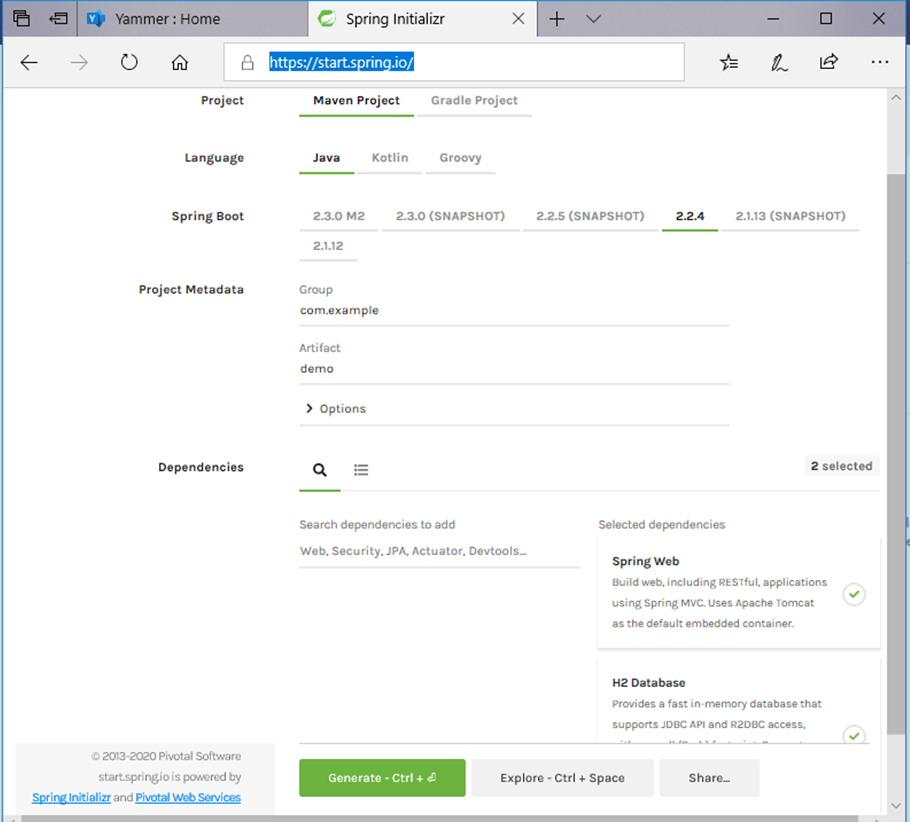

# Java - Excel Download

The application that demonstrates that the simple HTML can be rendered or downloaded as an excel sheet. Similar solution can be utilized when you don't have need for complex excel formatting.

You can use this article to understand simple
1. Spring Boot Application that uses Servlet.
2. Spring Boot Application that uses H2 Database as In-Memory Database.
3. Spring Boot Application that generates Excel sheet using the HTML Page.

# Spring Boot Application Creation

Create Spring Boot Application that has dependency of Web and H2 Database by visiting https://start.spring.io/. You can make the selection as outlined below:



After making selections similar to above, you can click on generate and download the maven project as zip file.

# Spring Configurations

Following configuration scans for Spring Prototype Annotations in the mentioned base package(s):
 
`@ComponentScan(basePackages = {"ind.gopinnath.example"})`

Following configuration defines the packages to scan for JPA entities:
 
`@EntityScan("ind.gopinnath.example.entity")`
 
Following configuration defines the packages to scan for Spring Data JPA Repositories
 
`@EnableJpaRepositories("ind.gopinnath.example.repository")`
 
NOTE : Above configurations are needed only in case the Application Class with Main Method is not placed in the parent package of the all the rest of the package. For example in the in sample code that is linked in section 6, if the "Application.java" file is moved to package "ind.gopinnath", then above configuration are not needed.
 
Following configuration will stop the Auto Configuration of the Spring MVC Dispatcher Servlet (this is optional step, i had disabled to make the runtime light weight): 

`@SpringBootApplication(exclude = { DispatcherServletAutoConfiguration.class, ErrorMvcAutoConfiguration.class })`

# Servlet Code

Following code in the Servlet class sends the response header to browser that gives the impression content in the response is of type Excel document and it will result in launching of the Excel application:
 
```
    response.setContentType("application/vnd.ms-excel");
    response.setHeader("Content-Disposition", "inline; filename=\"formattedExcelReport.xls\"");
```

# H2 Database

Following are the basic default configuration that is needed for H2 Database to work in-memory and goes into *"application.properties"*:

```
spring.datasource.url=jdbc:h2:mem:testdb
spring.datasource.driverClassName=org.h2.Driver
spring.datasource.username=sa
spring.datasource.password=password
spring.jpa.database-platform=org.hibernate.dialect.H2Dialect
```
Sample data can be loaded by creating "data.sql" file with the table creation and insert SQL statements:

```
DROP TABLE IF EXISTS employee;
 
CREATE TABLE employee (
  employee_id INT AUTO_INCREMENT  PRIMARY KEY,
  first_name VARCHAR(250) NOT NULL,
  last_name VARCHAR(250) NOT NULL,
  desingation VARCHAR(250) DEFAULT NULL
);
 
INSERT INTO employee (first_name, last_name, desingation) VALUES
  ('Ram', 'Sharma', 'Manager'),
  ('Shyam', 'Sunder', 'Associate'),
  ('Krishna', 'Ahuja', 'Executive');
```


# Sample Code

Please find the sample source code in the GITHUB at below URL:
 
https://github.com/gopinnath/excel-download-servlet-example
